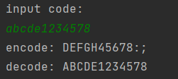

[toc]

## 1.作业基本信息


| 这个作业的目标       | 1.实现Caesar密码加解密 |
| -------------------- | ------------------------------------------------------------ |
| Github仓库           | *[仓库链接](http://10.21.4.83:81/3120005069/ns/-/tree/main/)*      |
| 其他参考文献         | ...|


## 2.计算模块接口的设计与实现过程

### 2.1 问题需求

> 题目：利用Caesar密码加解密作业

### 2.2 设计思路

凯撒加密(Caesarcipher)是一种简单的消息编码方式：它根据字母表将消息中的每个字母移动常量位k。

选用凯撒加解密的原因如下：

凯撒加密后的message整体偏移k个单位，解密的时候返回k个单位即可。

则运用此规则进行加密与解密操作。

设计思路如下：

**1. 对传入数据进行加密**

首先对传入的数据字符串转为列表，然后转ASCII码，对其进行k个单位的偏移

```python
# 加密
def caesar(message):
    message1 = message.upper()  # 把明文字母变成大写
    message1 = list(message1)  # 将明文字符串转换成列表
    list1 = []
    for i in range(len(message1)):
        if message1[i] == ' ':
            list1.append(message1[i])  # 若为空格不用移动
        elif ord(message1[i]) <= 90 - 3 + 1:  # A-X右移三位
            list1.append(chr(ord(message1[i]) + 3))
            result = ''.join(list1)  # 列表转换成字符串
        else:
            list1.append(chr(ord(message1[i]) - (26 - 3)))  # Y和Z回到A、B
            result = ''.join(list1)
    return result
```

**2. 对于密文进行解密**

解密则进行反向操作。


## 3.部分单元测试展示


以下为对于密文的测试结果




更多详细情况可以直接进行文件测试。