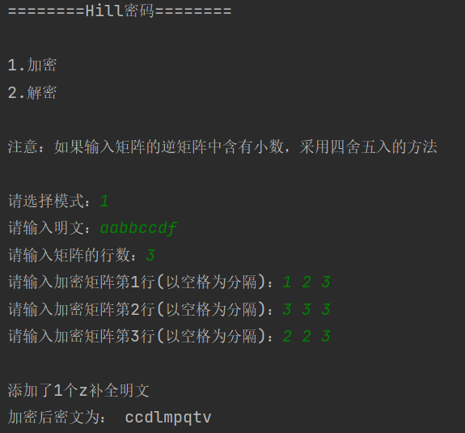
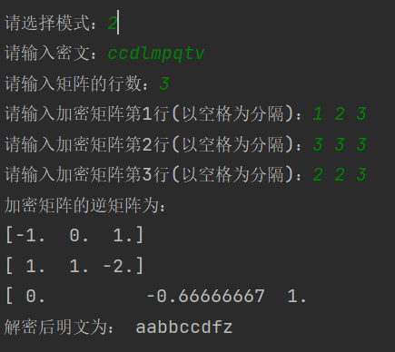

[toc]

## 1.作业基本信息

| 这个作业的目标       | 1.实现Hill密码加解密 |
| -------------------- | ------------------------------------------------------------ |
| Github仓库           | *[仓库链接](http://10.21.4.83:81/3120005069/ns/-/tree/main/)*      |
| 其他参考文献         | ...|

## 2.计算模块接口的设计与实现过程

### 2.1 问题需求

> 题目：利用Hill密码加解密作业

### 2.2 设计思路

希尔密码，是运用基本矩阵论原理的替换密码，由Lester S. Hill在1929年发明。

首先确定一个密钥，这个密钥为n × n的矩阵，并且必须是可逆的。然后将字符与数字创建映射表，一个字符对应一个数字。加密时，将明文分割为n个字符一组，在映射表中找到字符对应数字，每一组字符就变为一个1 × n 的矩阵，将这个矩阵与密钥相乘的结果模72（字典数据数目），再在映射表中找数字对应字符转化，就得到了密文。解密时，先将字符转数字，n个一组，形成1 × n 的矩阵，把这些矩阵与密钥的逆矩阵分别相乘，左乘还是右乘需要与之前一致，将乘得的结果加72的倍数转为正数后模72，将这些数字通过映射表转为明文。

设计思路如下：

**在本程序中，仅用字母作为字典**

**1. 对传入数据进行加密**

+ 输入数据后，将字母与字典替代，对应数字并准备化为矩阵；

+ 在输入约定的密钥矩阵时，判断是否可逆；

+ 密钥矩阵与输入数据的矩阵进行矩阵乘法，得出密文。

**2. 对于密文进行解密**

解密则运用约定的密钥矩阵，先求出其逆矩阵，然后与密文进行线代的矩阵乘法，求解出明文。

*需要注意的是，由于密钥矩阵与数据矩阵并不一定能够正好进行，矩阵的乘法运算（表现为密钥矩阵是 n X n 的，但数据矩阵可能并不能正好整除）此时数据方面需要添加一定冗余字符。*

## 3.部分单元测试展示

以下为对于密文的测试结果

更多详细情况可以直接进行文件测试。