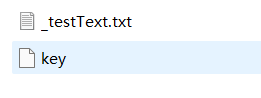

[toc]

## 1.作业基本信息


| 这个作业的目标       | 1.实现Github上提交文件<br>2.接口的导入及其使用<br>3.文件格式的规范化 |
| -------------------- | ------------------------------------------------------------ |
| Github仓库           | *[仓库链接](http://10.21.4.83:81/3120005069/ns/-/tree/main/)*      |
| 其他参考文献         | ...|


## 2.计算模块接口的设计与实现过程

### 2.1 问题需求

> 题目：利用异或运算实现加解密作业

### 2.2 设计思路

对于题目要求设计异或运算实现加解密的算法。

异或真值表如下：

| R    | S    | P    |
| ---- | ---- | ---- |
| 0    | 0    | 0    |
| 0    | 1    | 1    |
| 1    | 0    | 1    |
| 1    | 1    | 0    |

选用异或运算的原因如下：

一个数字message在通过两次与同一数字key进行异或运算后，依然能得到原来的数字message

则运用此规则进行加密与解密操作。

**加密操作：**

首先将文件转换成二进制数，再生成与该二进制数等长的随机密钥，将二进制数与密钥进行异或操作，得到加密后的二进制数。

**解密操作：**

将加密后的二进制程序与密钥进行异或操作，就得到原二进制数，最后将原二进制数恢复成文本文件。

设计思路如下：

**1. 生成随机密钥**

对于密钥，可以是用户约定的一组口令，这种方法操作比较简单，直接进行输入即可，在本程序中，采用系统生成的随机密钥，可以较为便利解决选择密钥问题。

运用python的secrets库中的伪随机数模块，生成随机密钥，为了密钥与之后的数据能进行异或操作，需要对生成的随机密钥进行数据处理，将密钥处理为所需要的二进制数。

```python
from secrets import token_bytes
from typing import Tuple

# 随机生成密钥
def random_key(length:int) -> int:
    key:bytes = token_bytes(nbytes=length)
    key_int:int = int.from_bytes(key, 'big')
    return key_int
```

**2. 对传入数据进行加密**

在encrypt函数中，传入str对象，返回元组，然后用encode，将字符串编码编码成字节串，再以同样的方式`int.from_bytes`将其转换为int二进制对象，然后用此二进制对象与所生成的随机密钥进行异或操作，得到加密文本。

```python
# 编码密文
def encrypt(raw:str) -> Tuple[int, int]:
    raw_bytes:bytes = raw.encode()
    raw_int:int = int.from_bytes(raw_bytes, 'big')
    key_int:int = random_key(len(raw_bytes))
    return raw_int ^ key_int, key_int
```

**3. 对于密文进行解密**

对于decrypt的解密函数，需要对加密文本和密钥进行异或操作，计算出解密后的文本，之后再将解密后的二进制对象转换为字节串对象，再通过decode，将字节串转换为字符串。

```python
# 解码密文
def decrypt(encrypted:int, key_int:int) -> str:
    decrypted:int = encrypted ^ key_int
    length = (decrypted.bit_length() + 7) // 8
    decrypted_bytes:bytes = int.to_bytes(decrypted, length, 'big')
    # decrypted_file=decrypted_bytes.decode()
    # print(decrypted_file)
    return decrypted_bytes.decode()
```

至此，对于异或操作进行加解密的程序算法已经列举在上，以下将描述关于文本存储和读取。

```python
# 文件中读取并调用编码密文
def encrypt_file(path:str, key_path=None, *, encoding='utf-8'):
    path = Path(path)
    cwd = path.cwd() / path.name.split('.')[0]
    path_encrypted = cwd / path.name
    if key_path is None:
        key_path = cwd / 'key'
    if not cwd.exists():
        cwd.mkdir()
        path_encrypted.touch()
        key_path.touch()
    with path.open('rt', encoding=encoding) as f1, \
        path_encrypted.open('wt', encoding=encoding) as f2, \
            key_path.open('wt', encoding=encoding) as f3:
        encrypted, key = encrypt(f1.read())
        json.dump(encrypted, f2)
        json.dump(key, f3)

# 文件中得出并存储解码密文（明文）
def decrypt_file(path_encrypted:str, key_path=None, *, encoding='utf-8'):
    path_encrypted = Path(path_encrypted)
    cwd = path_encrypted.cwd()
    path_decrypted = cwd / 'decrypted'
    if not path_decrypted.exists():
        path_decrypted.mkdir()
        path_decrypted /= path_encrypted.name
        path_decrypted.touch()
    if key_path is None:
        key_path = cwd / 'key'
    key_path = cwd.cwd() / path_encrypted.name.split('.')[0] / 'key'
    path_decrypted = cwd / 'decrypted' / path_encrypted.name
    with path_encrypted.open('rt', encoding=encoding) as f1, \
            key_path.open('rt', encoding=encoding) as f2, \
            path_decrypted.open('wt', encoding=encoding) as f3:
        decrypted = decrypt(json.load(f1), json.load(f2))
        f3.write(decrypted)
```


## 3.部分单元测试展示


以下为对于密文的测试结果


以下为对于处理文件的存储结果


以下为密文与密钥的存储文件




更多详细情况可以直接进行文件测试。